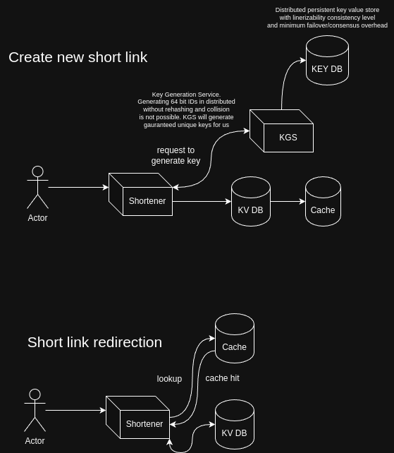

# High Level Design

Before digging in database schema, cache, load balancer, partitioning, replication and etc
I wanna think about high level design of URL Shortener based on requirements and capacity estimation.
Then we can talk about each component separately.

