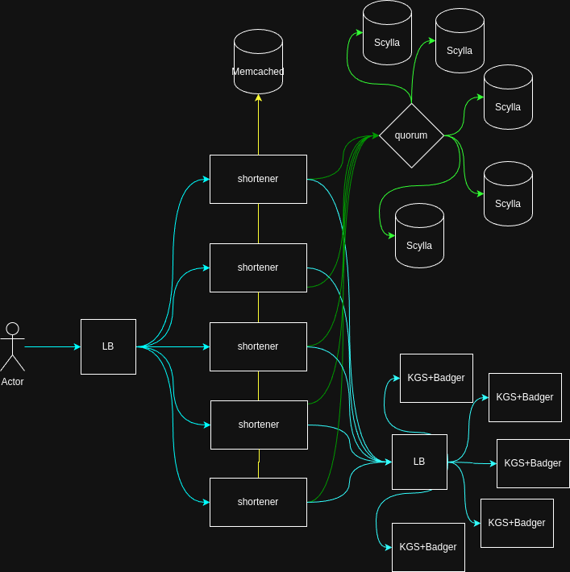

# Detailed Design

We have a load balancer over user requests for link creation to shortener service. It will send request to KGS load balancer.
Each KGS instance are stateful applications with embedded Badger KV store with independent configured range of counter for
start.
Each key request to KGS will causes to counting keys and this operation is also independent.

This solution do not need failover because each KGS instance produce unique keys and there are no overlap.
